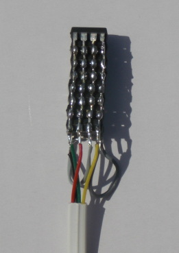
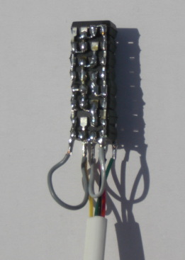
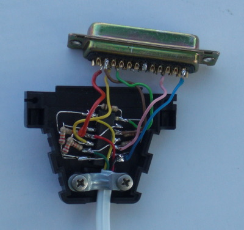

==================================
HOWTO: Try out the 0cpm Firmerware
==================================

Please read this entire document before getting started.

.. contents::

Before you start
================

**Warning:** This is premature for most users.  The 0cpm Firmerware is pre-alpha,
        and not everything about it is working.  Developers however, may enjoy
        trying it.  Some hardware work is involved, though.

**Platform:** The 0cpm Firmerware is developed on a `Grandstream BT-200`_, but its
        configuration menus are already prepared for other models, and even
        other manufacturers.  If you cannot source a BT-200 anymore (they are
        not sold any longer) then you may want to try another device, like
        the GXP-1200 or a more advanced model with an EXT connector.  The EXT
        connector that I've seen is an externalised I2C connector.  The GXP
        and recent BT-200 platforms are all pretty much constant in structure,
        their main differences being the wiring and the new LCD on the GXP
        series.

.. _`Grandstream BT-200` : http://devel.0cpm.org/firmerware/pix/bt200-twohalves.jpg

Chips supported in the 0cpm Firmerware
--------------------------------------

First, you may want to check a few things:

* The DSP chip is a TMS320VC5501PGF
* The Codec chip is a TLV320AIC20K
* The Network chip is a KSZ8842-16MQL

A few older models were different:

* BT-100 uses a tic54x DSP, which boots over SPI instead of I2C.
  SPI is not a bus, making the development process less comfortable.
  It is quite possible, though.
* Older BT-200 and GXP-2020 used RTL8019AS network chips, and possibly
  an RTL8035SC switch.  It should be trivial to add support for those,
  although I've also seen very early devices with two network chips and
  switching done in the DSP, that would be a bit harder.

Study the hardware information
------------------------------

The documentation for the BT 200 is the most extensive, and since
it is similar to all other models, you should probably start there.
There are separate pages to describe the PCB_ and GPIO_.  You may
also want to read a bit about the Connectors_ found on board.
Finally, I keep a `datasheet archive`_ for your reference.  Please
spare my bandwidth by downloading the entire set to your local system
once?

.. _PCB : http://reverse.0cpm.org/grandstream/pcb-bt200.html

.. _GPIO : http://reverse.0cpm.org/grandstream/gpio-bt200.html

.. _Connectors : http://reverse.0cpm.org/grandstream/connect.html

.. _`datasheet archive` : http://reverse.0cpm.org/grandstream/datasheet/

Setting up the hardware
=======================

Let's get the soldering iron out first.

Tip: Solder a switch in the powerline
-------------------------------------

The design of the phone is made to be always-on.  You want to reset a lot more
often than designed though, so you probably should solder a switch in the 5V-side
of your phone's power supply.  It's very simple but extremely useful.

Create your I2C bootstrapping setup
-----------------------------------

Get a number (up to eight) I2C EEPROMs of 64 kB each, and stack them
as shown below.  You can connect most pins, as these constitute a bus,
but an exception must be made for the pins A0/A1/A2, which must each
have a differnt combination of ones and zeroes.  I've used a Gray
coded addressing scheme, and could therebby set different values to
all pins without crossing wires and without even needing more wire
than the clipped-off or bent-aside address pins ``;-)``

   The "bus side" of the EEPROM stack simply connects all lines.

   The "address side" of the EEPROM stack offers different values to A0/A1/A2.

The Gray code for this example would be:

        ==== ==== ====
        A0   A1   A2
        ==== ==== ====
        0    0    0
        0    0    1
        0    1    1
        0    1    0
        1    1    0
        1    1    1
        1    0    1
        1    0    0
        ==== ==== ====

Now solder a cable to the I2C connector on the phone's PCB.  This
looks like a single line of 6 pins that are 2mm (!) apart:

        ======  ===========
        Pin     Signal
        ======  ===========
        1       VTref
        2       SDA
        3       SCL
        4       BOOTM[0]
        5       BOOTM[2]
        6       GND
        ======  ===========

The device normally boots with BOOTM[2:0] temporarily pulled to 011 during system reset, causing it to boot from the Flash chip on the PCB.  When booting over I2C is preferred, the I2C EEPROMs can be connected as a consecutive address range. To activate this boot mode, BOOTM[2:0] must be set to 110, so pin 5 of J402 must be pulled high and pin 4 must be pulled low.  The build environment for the 0cpm Firmerware constructs an image properly formatted for boot over I2C.

I've created a sequence of connectors that turned out to be really helpful::

                         A  /---- bootkey
   phone I2C --------------<                   /----- EEPROM stack
                            \-----------------<
                                            B  \----------------------- parport-i2c

The splits are made from 2x6 recptors for pin headers.  I bent the pins so that
the same signals appear on adjacent pins; this is connector A:

        =========== ===========
        Signal      Signal
        =========== ===========
        VTref       VTref
        SDA         SDA
        SCL         SCL
        BOOTM[0]    BOOTM[0]
        BOOTM[2]    BOOTM[2]
        GND         GND
        =========== ===========

And this is connector B:

        =========== ===========
        Signal      Signal
        =========== ===========
        SCL         SCL
        GND         GND
        SDA         SDA
        VTref       VTref
        =========== ===========

The bootkey can be inserted to boot from the I2C EEPROM stack, or
retracted to boot the standard firmware.  Being able to do the
latter is a big help if you are ever in doubt whether you've
destroyed the hardware.  If you did, usually you've pulled a
connector loose, or pushed so hard on pins that they've flown
to touch each other.  In the latter case, get a needle and
scratch the pins apart again.  This happened to me fairly
regularly; other than that, the hardware is rock-solid.

The connections of the boot key are:

        =========== ===========
        Signal      Signal
        =========== ===========
        VTref       wire 1
        SDA         n/c
        SCL         n/c
        BOOTM[0]    wire 2
        BOOTM[2]    wire 1
        GND         wire 2
        =========== ===========

Be sure to mark the "1" sides on all your connectors, and to
attach labels to each cable explaining what they do and what
signals they are made for.

For parport-i2c, please construct an I2C interface as documented
in the Linux kernel.  The 0cpm Firmerware contains a programming
utility under ``bin/i2cp``.  I've found that the TTL logic of
the 5V-based parallel port on my PC naturally yielded levels
that would work for I2C at 3V3.  Be careful though, you may
end up blowing more than your mind away.

   The entire parport-i2c interface fits inside a D-BUS plug.

Getting started with development
================================

Time to get all soft now.

Setting up your development environment
---------------------------------------

Get the toolchain from TI.  They make it available at no cost.
Unfortunately their license is a bit tight about distributing the
toolchain alongside software that is not purely intended for their
chips.  I intend to wiggle this a bit and get a special arrangement
for the 0cpm Firmerware in light of the GPLv3 requirements.

The toolchain can be found on ti.com, but may take some searching;
its location is not constant and they are more eager in showing
their more complete (and much more pricy) Code Composer Studio.
But TI is motivated to support open source projects, and will even
help you out if you cannot find it.  (Or I could, of course.)

I installed to toolchain into ``/opt/tic55x-ti/`` and this may
actually be reflected in these early build environments.  Other
than this, you would need the usual suspects -- notably, ``make``.

Checking out the 0cpm Firmerware
--------------------------------

I hope to have all that is required for an outsider build available
in GIT; the only exception may be a few booting scripts that setup
the BSS and STATIC areas, and a number of registers that need to be
setup early in the hardware.

Sorry I haven't taken the time to check outsider builds yet, that
is one reason why this is pre-alphe software.  If you end up in
unsolveable trouble, contact me and I can probably help you out.

Note that the reason that these parts are missing is because I don't
want to break anyone's copyrights, which publication in GIT would
do.  I can proably talk you through finding it in your local setup though.

Anyhow, this is the GIT repository for the 0cpm Firmerware:

        git://git.0cpm.org/firmerware/

You should be able to clone it and continue from there.
Once again, this is pre-alpha software, I aim to checkin only
compiling versions but in this phase I suppose I'm allowed to
be human.  Please don't expand on my mistakes by checking in
your non-compiling versions into my repository.

Configuring the 0cpm Firmerware
-------------------------------

In the root directory of the 0cpm Firmerware, type::

        make menuconfig

You will recognise the same build system as used by Linux
and BusyBox, which I've shamelessly, ehm... shared.

Make the following setup:

* Configuration meta: Setup your toolchain prefix, and use
  the 6bed4 address announced on http://devel.0cpm.org/6bed4/
  and development build options shown to you.
  or --at some point hopefully-- in the RFC.
* Hardware manufacturer: Grandstream
* Phone models: Budgetone 200/201
* Hardware platform: tic55x
* Under Firmware Functions, start with the first primary
  function and work your way up to the SIP phone over IPv6.
  Read the respective Help page to see what it is doing.

Note that various functions claimed in the configuration
are not implemented yet; pre-alpha, remember?

Building the 0cpm Firmerware
----------------------------

Couldn't be simpler::

        make

The resulting firmware is found in ``bin/firmerware.bin``.

Testing the 0cpm Firmerware on the phone
----------------------------------------

Assuming you've soldered the EEPROM stack that I suggested,
you could use the ``i2cp`` utility.  You may need to build
it first::

        pushd bin/i2cp
        make
        popd

Then you can upload it as follows, but possibly with a
different I2C bus::

        i2cp bin/firmerware.bin /dev/i2c-2

Now reboot the phone with the boot key inserted.  The
bootloader will recognise your wish to bootstrap the
DSP from the I2C EEPROMs.  Permit a few seconds for the
I2C download and DSP setup.  Still, it's a lot faster
than the original firmware, mostly because it is smaller.

You can now conduct the tests described for the main
function that you selected.

Observing the phone's console
-----------------------------

Go ahead and stare at the display.

No, seriously, the phone can keep a log, although not in the
simplest test programs and otherwise as a configurable option.

The logs are accessed over LLC2_.  You will need the tool
``llcio`` contained in by hexio_ package.  You may find more
utilities in this package useful when working with hardware;
for example, if you need a binary variation of ``minicom``.

.. _LLC2 : llc.html

.. _hexio : http://rick.vanrein.org/linux/hexio/

Download the Flash memory to your PC
------------------------------------

When built with a bootloader main function, it is possible
to extract the entire contents of flash from the phone.
This is done over LLC1_, using an adapted TFTP utility
described under that link.

.. _LLC1 : llc.html

Making changes to the 0cpm Firmerware
=====================================

You are going to accept the 0cpm Firmerware without
a further thought, right?  No bright ideas or wish
to innovate and extend?

Oh, so you *do* have ideas... well then... read on!

Legal hoops to jump through
---------------------------

I welcome patches with whole my heart ``;-)`` but must
tell you right away: the TI compiler license is a bit
silly; it can only be distributed alongside software
that is strictly targeted for their chips.  This means
that distributing the 0cpm Firmerware is either a breach
of their agreement, or GPLv3.  As the code originator,
only I am not bound by the GPLv3 and can hand out the
code with a reference to the TI website for the tools.

I am asking all submitters to agree that I continue to
do this.  In other words, they would not be providing
their updates under the GPL but under a more liberal
agreement.  This is what I need to keep the code
generally available.  I am sorry about this loophole
and will ask TI for more freedom as soon as the firmware
is stable, and something that TI would be proud of supporting.

If TI wouldn't want to bend, we could always move over to
opener architectures, like Blackfin.  I want to use the
GPLv3 so there is no risk of manufacutrers legally
splitting off a closed fork.  To be honest, at the time
this project started I was already quite happy to have
an initial platform to get the work going.  Already now,
the firmware is much more solid and would probably be
simple to port.

Submissions of changes
----------------------

For now, email should do fine.  I'll scale up to
automatic things when I have to.  Perhaps you could
publish your work in GIT and tell me about it.

Porting to other hardware
-------------------------

If you want to port to other infrastructure you should really
read the porting guide, contained in the ``doc`` directory of the
0cpm Firmerware.

Manufacturing phones for the 0cpm Firmerware
--------------------------------------------

Please read the hardware design manual, contained in the ``doc``
directory of the 0cpm Firmerware.

Chores waiting for you to jump at them
--------------------------------------

There are a couple of chores that give me the feeling
that this project is growing over my head.  Perhaps you
could help out with those:

* Personally, I've tried for months (on and off) to get
  the codec chip TLV320AIC20K working.  I have not given
  up hope, but am wondering why I cannot get it to work.
  Your input on that may be useful.

* The flash contains firmware that can be upgraded, but
  the updates for code portions are somehow signed.  It
  would be tremendously useful if someone sent me the
  algorithm.  I would be happy to accept an anonymous
  donation of such an algorithm from a determined code
  analyst.

* Various GXP models should be supported.  So, rather than
  purchasing the GXP1200, you could consider getting another
  model, and adapting the firmware to match it.

* There are exciting extension possibilities; Grandstream
  has a GXV series involving a camera, colour display and
  sometimes even a touch screen.  It would be lovely if
  someone found the time to look into those.  They use
  a tic6x architecture AFAIK.

* DECT is not as open as Ethernet, so I may need help from
  others in developing that area.  Also, the model of DECT
  is somewhat different -- a base station runs as a
  multi-headed dragon, servicing multiple users who each
  hold their own terminal.

* ATAs are useful devices to those who are just getting
  started with SIP, and also as intermediaries for textphones
  in use by the deaf.  Supporting the chips used in those
  should be a treat in tone recognition and sound handling.
  I mean it, the chips used look very interesting.

* In a second phase of ATA support, a very special piece of
  hardware to support could be Rowetel's `$10 ATA`_,
  designed as an extension to OpenWRT.  Rowetel is doing
  great work by supporting telecommunications for development
  countries; this is a vital piece of technology to enable
  people to plan and arrange things, and helps to set them
  free.  You may also find an extremely low bitrate codec
  named Codec2 as part of the 0cpm Firmerware; it is there
  to enable these developing countries to connect to the
  rest of the world at the low bitrates that they are
  dependent upon over there.

* The new GXP series has graphical displays that need
  reverse engineering; I've done some work on it but
  am not ready.

.. _`$10 ATA` : http://www.rowetel.com/blog/?p=1987

